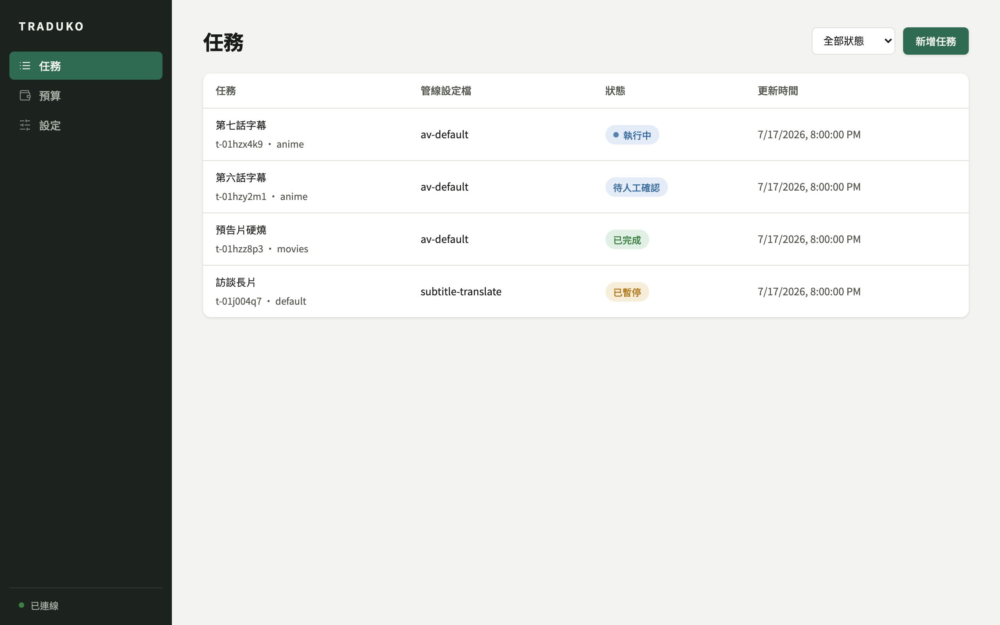
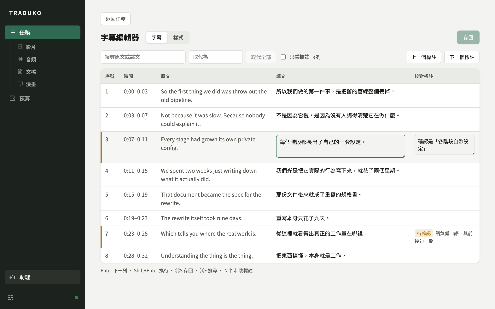
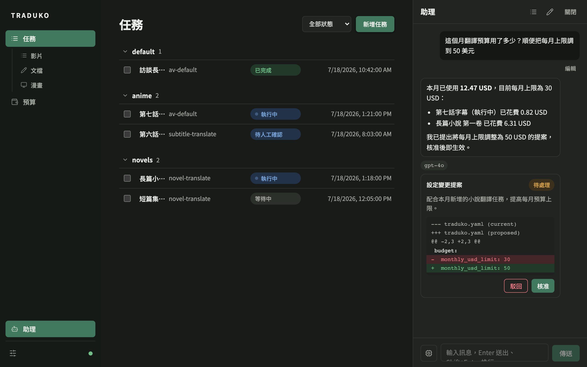
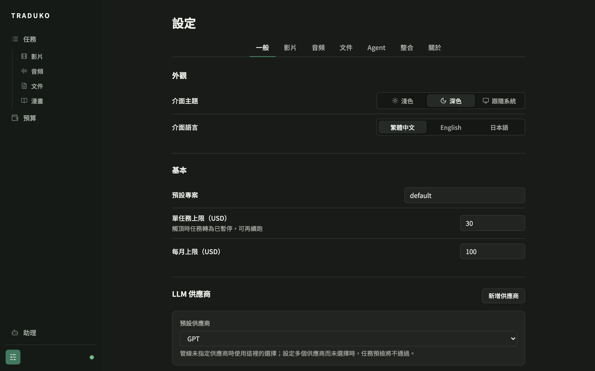

<div align="center">


# Traduko

Automated subtitle and document translation for the desktop — audio extraction, speech recognition, LLM translation, agent proofreading, and export in one pipeline.

[Documentation](README.md) · [繁體中文](README.zh-TW.md) · [Architecture](#architecture) · [Installation](#installation)

</div>

---

Traduko runs a configurable pipeline over video, audio, or subtitle files: audio extraction, speech recognition, segmentation, LLM translation, optional agent-based proofreading, and subtitle export. The name is the Esperanto word for "translation".

The project is an orchestration layer over existing tools rather than a new engine: ffmpeg for media handling, faster-whisper for speech recognition, and any OpenAI-compatible endpoint for translation.









## Features

- Input can be a video, an audio file, or an existing subtitle file (SRT/VTT/ASS/TXT). Output formats are SRT, VTT, and ASS, with optional hardburn into the video.
- Pipelines are defined as YAML profiles listing a sequence of stages. Stages can be added, removed, or reconfigured, and a manual review checkpoint can be placed after any stage.
- The desktop app includes a subtitle table editor for revising translations line by line, and an ASS style editor with a CSS approximation preview and exact frame rendering through ffmpeg. Saving edits resets downstream stages so the task can be re-run from that point.
- Proofreading runs as a tool-using agent loop: it can consult the glossary and surrounding context and revise lines over multiple rounds. Intensity is configurable; if the budget runs out mid-proofread, the current best version is kept.
- Token usage is priced and metered. A task pauses when it reaches its budget cap and can be resumed after the cap is raised. Translation progress is written to disk incrementally, so an interrupted task does not lose completed work.
- A glossary keeps terminology consistent across the file. Prompt templates for translation and proofreading are plain text files in the data directory and can be edited directly.
- A preflight check validates the input file, ffmpeg, the ASR model, LLM credentials, and budget before a task starts.
- Task events can be sent to webhooks, Discord, and email. A Discord bot provides slash commands for listing, running, pausing, and canceling tasks, and keeps a progress message updated in the channel.
- Settings, prompts, glossaries, and task records can be synced between machines through a shared local folder (for example a Dropbox directory) or WebDAV. Glossary changes are merged row by row; conflicting rows are left for a manual decision. Tasks from other machines are shown read-only.
- All tasks, artifacts, and settings are human-readable files under the data directory. SQLite serves only as an index and can be rebuilt from the files at any time.

The interface language can be switched between Traditional Chinese, English, and Japanese.

## Architecture

```
+--------------------+        HTTP / WebSocket        +---------------------+
|  Desktop app       | <----------------------------> |  Core service       |
|  (Tauri 2 + React) |        127.0.0.1 + token       |  (Python / FastAPI) |
+--------------------+                                +---------------------+
                                                          |
                                              pipeline stages: ffmpeg,
                                              faster-whisper, LLM providers
```

- `core/`: the Python engine. Task model, pipeline executor, stage implementations, LLM/ASR provider abstractions, the resident service, and the CLI.
- `app/`: the Tauri 2 + React 19 desktop shell. It talks to the core API only; the GUI and the CLI are equivalent clients.

The data directory defaults to the platform user-data location (`~/Library/Application Support/traduko` on macOS) and can be overridden with the `TRADUKO_DATA_ROOT` environment variable.

## Installation

Currently built from source. Requirements:

- Python 3.11+ and [uv](https://docs.astral.sh/uv/)
- ffmpeg (media processing and hardburn)
- Node.js with pnpm, and a Rust toolchain (only needed for the desktop app)

### Engine and CLI

```bash
cd core
uv sync
uv run traduko --help
```

For local speech recognition, install the ASR extra:

```bash
uv sync --extra asr
```

### Desktop app

Development mode (requires a running core, or `traduko` on PATH):

```bash
cd app
pnpm install
pnpm tauri dev
```

Release build (bundles the core as a PyInstaller sidecar):

```bash
bash core/packaging/build_sidecar.sh
cd app && pnpm tauri build
```

The bundled core does not include faster-whisper; run the core from a Python environment if you need local ASR.

## Usage

On first start the data directory is seeded with default profiles (`av-default`, `av-dub`, `subtitle-translate`, `novel-translate`, `translate-pdf`, `audio-transcribe`, `audio-translate`, `audio-dub`), prompt templates, subtitle styles, and a pricing table. All of these are commented plain-text files and can be edited.

CLI basics:

```bash
# create and run a subtitle translation task
uv run traduko task create input.srt --profile subtitle-translate
uv run traduko task run <task-id>

# inspect tasks
uv run traduko task list
uv run traduko task show <task-id>

# start the resident service (the desktop app's backend)
uv run traduko serve
```

To use a real LLM, add a provider in the desktop app under Settings → General (any OpenAI-compatible endpoint, Anthropic, or Gemini) and pick a default when several are configured. Stages whose profile `provider` is `fake` or unset automatically use that default, with no YAML editing required. Editing `llm_providers` and `default_provider` in `config/core.yaml` directly has the same effect. With no provider configured, the `fake` provider exists for offline dry runs and outputs placeholder text prefixed with `[T]`.

## Development

```bash
cd core && uv run pytest            # engine tests
cd app && pnpm test                 # frontend unit tests
cd app && pnpm test:integration     # frontend/backend integration tests
cd app/src-tauri && cargo test      # Rust shell tests
```

## Roadmap

- Comic translation pipeline
