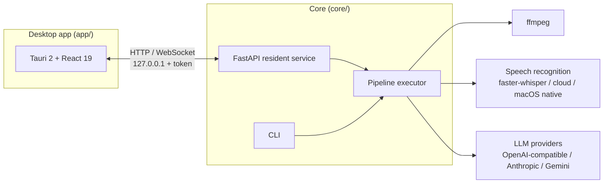

<div align="center">


# Traduko

An automated translation workstation for the desktop. Give it video, audio, subtitles, or documents, and the pipeline handles speech recognition, translation, proofreading, dubbing, and export. Proofreading is itself a tool-using agent, and the interface can be operated by one.

[Features](#features) · [Interface](#interface) · [Architecture](#architecture) · [Installation](#installation) · [Usage](#usage) · [Roadmap](#roadmap) · [繁體中文](README.zh-TW.md)

</div>

---

Traduko runs a configurable pipeline over each input: audio extraction, speech recognition, segmentation, LLM translation, optional agent-based proofreading, dub synthesis, and export to subtitles or finished media. The name is the Esperanto word for "translation".

It is an orchestration layer over existing tools: ffmpeg for media handling, faster-whisper or cloud engines for speech recognition, and any OpenAI-compatible endpoint, Anthropic, or Gemini for translation. Traduko turns them into tasks that can be paused, resumed, and kept within a spending budget.

What the project builds itself is the agent wiring. Proofreading runs as a multi-round loop that consults the glossary and surrounding context before revising lines and leaving notes. The built-in assistant reads every artifact a task produces and can change task settings or re-run stages; changing global configuration is limited to filing a proposal that an operator approves. Its tool set extends through MCP servers and Skills.


## Features

### Translation pipeline

| Feature | Description |
| --- | --- |
| Inputs and outputs | Accepts video, audio, subtitle files (SRT/VTT/ASS/TXT), and documents such as PDF. Subtitle output in SRT, VTT, and ASS, with optional hardburn into the video. |
| Pipeline definition | Pipelines are YAML profiles describing a sequence of stages. Stages can be added, removed, or reconfigured, and a manual review checkpoint can follow any stage. |
| Pipeline switches | Translation, speaker diarization, and dubbing can be toggled per task. A switched-off stage is marked skipped and keeps its artifacts; switching it back on resumes from there. |
| Speaker diarization | Optional. With it off, synthesis voices every line as a single speaker and dubbing proceeds normally. |
| Compose from transcript | "Compose audio" and "Compose video" produce a dubbed result straight from a transcript, which can be an srt/vtt/txt file on disk or an artifact of an existing task. |
| Preflight | Before a task starts, the input file, ffmpeg, the ASR model, LLM credentials, and the budget are validated. |

### Editing and studios

| Feature | Description |
| --- | --- |
| Subtitle editor | Table-based, line-by-line revision. Proofread notes are editable like the translation column; editing a note leaves downstream stages alone, while saving a translation resets them so the task can re-run from that point. |
| ASS style editor | Live CSS-approximation preview plus exact frame rendering through ffmpeg. |
| Dubbing studio | TTS engine and parameters, dub text as translation or source, per-speaker reference audio, per-segment preview, and two-level redub. |
| Export studio | Video and audio encoding parameters, output estimates with a disk space check; exports run as appended stages. |
| Translation settings | Target language and prompt override, retranslate. Defaults are configured per task domain (video, audio, document), applied at task creation, and can be overridden per task. |
| Output browser | Outputs grouped as video, audio, images, and documents. Audio plays inline; subtitle and plain-text outputs preview in place with an adjustable text size. |

### Agent

| Feature | Description |
| --- | --- |
| Agent proofreading | Proofreading runs as a tool-using loop over multiple rounds: it consults the glossary and surrounding context, revises lines, and leaves notes. Intensity is configurable, and if the budget runs out mid-proofread the current best version is kept. |
| Built-in assistant | Reads task status, budget, configuration, logs, preflight results, and artifact contents (transcripts, translations, proofread and quality notes, speaker assignments). It can create tasks, flip pipeline switches, redub, retranslate, and export; changing global configuration is limited to filing a proposal that takes effect only after an operator approves it. |
| MCP and Skills | MCP servers can be mounted, and their tools join the assistant's tool set directly. Skills are plain text files, validated for format and passed through a safety gate before loading. |

### Glossaries

| Feature | Description |
| --- | --- |
| Multi-table glossaries | Each table is bound to one task domain or shared, with categories and CSV/JSON import/export. A task selects any set of global tables plus its own task-local table. |
| ASR biasing | Glossaries also bias speech recognition: supported engines take a prompt injection, the rest can get a lightweight proofread stage. Changes can be reapplied to existing tasks. |
| Prompt templates | Translation and proofreading prompts are plain text files in the data directory and can be edited directly. |

### Spending and reliability

| Feature | Description |
| --- | --- |
| Budget ledger | Token usage is priced and metered per call, with per-model spend share, ranking, and time-range filters. |
| Budget cap | A task pauses when it reaches its cap and can resume after the cap is raised. |
| Incremental writes | Translation progress is written to disk in batches, so an interrupted task keeps its completed work. |
| Files first | All tasks, artifacts, and settings are human-readable files under the data directory. SQLite serves only as an index and can be rebuilt from the files at any time. |

### Integrations and sync

| Feature | Description |
| --- | --- |
| Event notifications | Task events go to webhooks, Discord, and email. A Discord bot provides slash commands and keeps a progress message updated in the channel. |
| Multi-machine sync | Settings, prompts, glossaries, and task records sync through a shared folder or WebDAV. Glossaries merge row by row; conflicts are left for a manual decision. |
| Interface language | Traditional Chinese, English, and Japanese. |

## Interface

<table>
<tr>
<td width="50%"><br /><sub>Task detail: inline player, studio entries, pipeline switches, and stage progress.</sub></td>
<td width="50%"><br /><sub>The assistant files config changes as approvable diffs; nothing applies before approval.</sub></td>
</tr>
<tr>
<td><br /><sub>Outputs grouped by kind; audio plays inline, subtitles preview in place.</sub></td>
<td><br /><sub>Subtitle editor; both the translation and the proofread note are editable.</sub></td>
</tr>
<tr>
<td><br /><sub>ASS style editor with a live preview.</sub></td>
<td><br /><sub>Dubbing studio: engine and parameters, speakers with reference audio, per-segment preview.</sub></td>
</tr>
<tr>
<td><br /><sub>Settings: appearance, interface language, and LLM providers.</sub></td>
<td><br /><sub>Speech-recognition engine menu and dubbing engine.</sub></td>
</tr>
<tr>
<td colspan="2"><br /><sub>Budget ledger: per-model spend share and ranking.</sub></td>
</tr>
</table>

## Architecture



- `core/` is the Python engine: task model, pipeline executor, stage implementations, LLM and ASR provider abstractions, the resident service, and the CLI.
- `app/` is the Tauri 2 + React 19 desktop shell. It talks to the core API only; the GUI and the CLI are equivalent clients.

The data directory defaults to the platform user-data location (`~/Library/Application Support/traduko` on macOS) and can be overridden with the `TRADUKO_DATA_ROOT` environment variable.

## Installation

### macOS (Apple silicon)

Download the dmg from [Releases](https://github.com/Kahozue/traduko/releases). It bundles the core, so no separate Python install is needed. The app is not notarized; the first launch needs an allow in System Settings → Privacy & Security. The bundled core does not include faster-whisper; run the core from a Python environment if you need local speech recognition.

### Building from source

| Requirement | Used for |
| --- | --- |
| Python 3.11+ and [uv](https://docs.astral.sh/uv/) | Core engine |
| ffmpeg | Media processing and hardburn |
| Node.js with pnpm, Rust toolchain | Desktop app only |

Engine and CLI:

```bash
cd core
uv sync
uv run traduko --help

# for local speech recognition
uv sync --extra asr
```

Desktop app (development mode requires a running core, or `traduko` on PATH):

```bash
cd app
pnpm install
pnpm tauri dev
```

A release build bundles the core as a PyInstaller sidecar:

```bash
bash core/packaging/build_sidecar.sh
cd app && pnpm tauri build
```

## Usage

On first start the data directory is seeded with default profiles, prompt templates, subtitle styles, and a pricing table. All of these are commented plain-text files and can be edited directly.

| Profile | Purpose |
| --- | --- |
| `av-default` / `av-dub` | Video to subtitles; the latter adds dubbing |
| `subtitle-translate` | Translate an existing subtitle file |
| `novel-translate` / `translate-pdf` | Novel text and PDF document translation |
| `audio-transcribe` / `audio-translate` / `audio-dub` | Audio to transcript, translation, dubbing |
| `video-compose` / `audio-compose` | Compose video or audio deliverables from a transcript |

CLI basics:

```bash
# create and run a subtitle translation task
uv run traduko task create input.srt --profile subtitle-translate
uv run traduko task run <task-id>

# inspect tasks
uv run traduko task list
uv run traduko task show <task-id>

# compose a dubbed audio file from a transcript
uv run traduko task create --profile audio-compose --transcript lines.srt

# pipeline switches, translation settings, dub parameters, one-off exports
# (no flags reads the current values)
uv run traduko task switches <task-id> --no-dub
uv run traduko task translate-opts <task-id> --target-language ja
uv run traduko task dub-params <task-id> --voice-mode design
uv run traduko task export <task-id> --kind audio --source dub

# start the resident service (the desktop app's backend)
uv run traduko serve
```

To use a real LLM, add a provider in the desktop app under Settings → General (any OpenAI-compatible endpoint, Anthropic, or Gemini) and pick a default when several are configured. Stages whose profile `provider` is `fake` or unset automatically use that default, with no YAML editing required. Editing `llm_providers` and `default_provider` in `config/core.yaml` directly has the same effect. With no provider configured, the `fake` provider exists for offline dry runs and outputs placeholder text prefixed with `[T]`.

## Tech stack

| Layer | Technology |
| --- | --- |
| Desktop shell | Tauri 2, React 19, TypeScript |
| Core | Python 3.11, FastAPI, Pydantic |
| Media | ffmpeg |
| Speech recognition | faster-whisper, OpenAI cloud transcription, macOS native (SpeechAnalyzer) |
| Speech synthesis | VoxCPM2 (local voice cloning and design), macOS say (fast preview) |
| Translation and proofreading | Any OpenAI-compatible endpoint, Anthropic, Gemini |
| Agent extensions | MCP servers, plain-text Skills |
| Storage | Human-readable plain-text files, SQLite as an index only |

## Development

```bash
cd core && uv run pytest            # engine tests
cd app && pnpm test                 # frontend unit tests
cd app && pnpm test:integration     # frontend/backend integration tests
cd app/src-tauri && cargo test      # Rust shell tests
```

Issues are welcome for bug reports and feature discussion. Please run the test suites above before submitting changes.

## Roadmap

| Topic | Status |
| --- | --- |
| Video subtitling and hardburn | Available |
| Audio transcription, translation, and dubbing | Available |
| Document translation (novels, PDF) | Available |
| Glossaries, agent proofreading, budget ledger | Available |
| Comic translation pipeline | Planned |

## License

MIT. See [LICENSE](LICENSE).
