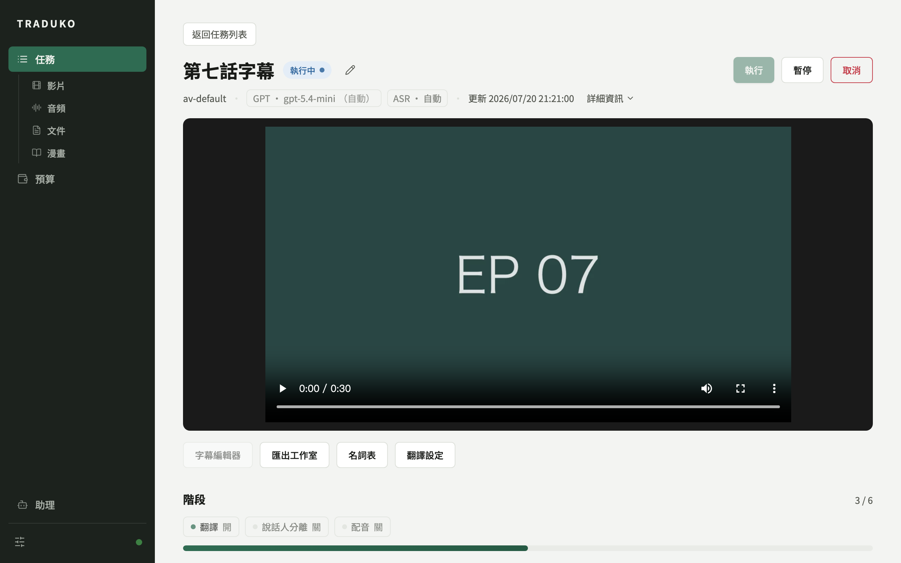
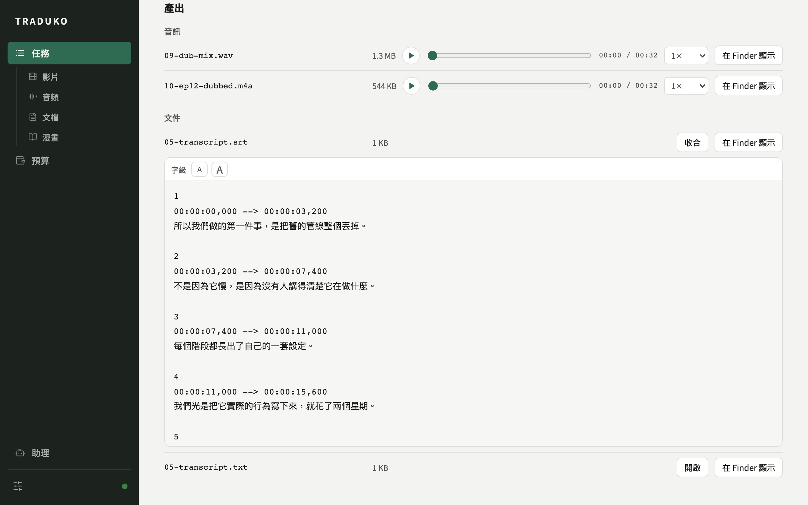
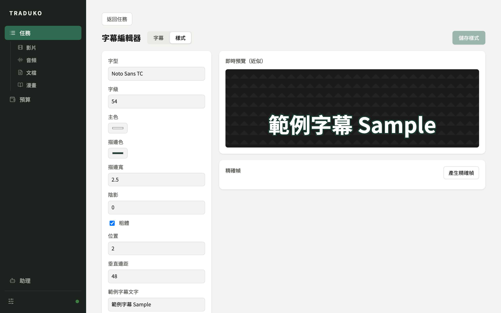
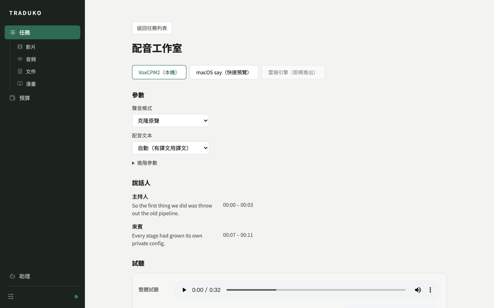
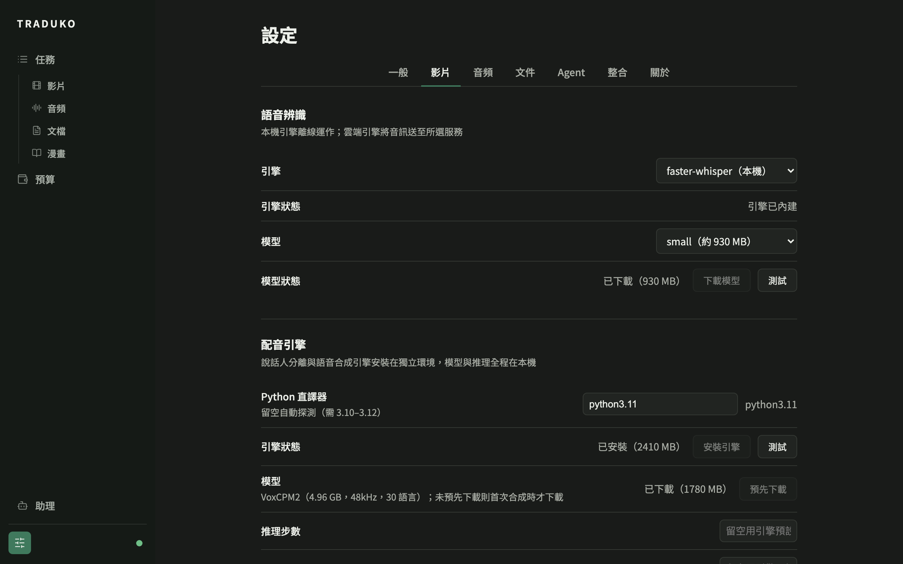
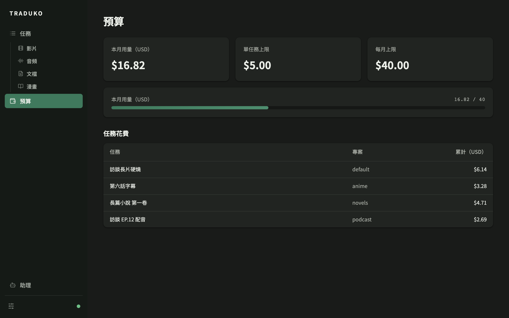
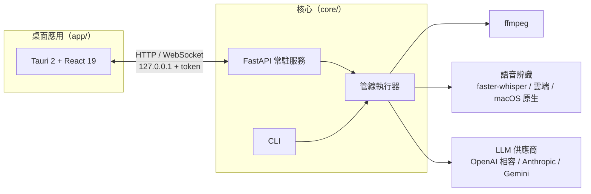

<div align="center">


# Traduko

桌面端的自動翻譯工作站。輸入影片、音訊、字幕或文件，管線完成語音辨識、翻譯、校對、配音與匯出。校對本身是帶工具的 agent，介面上的操作也能交給 agent。

[主要功能](#主要功能) · [介面總覽](#介面總覽) · [架構](#架構) · [安裝](#安裝) · [使用](#使用) · [路線圖](#路線圖) · [English](README.md)

</div>

---

Traduko 對輸入檔執行可設定的管線：抽取音軌、語音辨識、斷句、LLM 翻譯、可選的 agent 校對、配音合成，最後輸出字幕或成品影音。名稱取自世界語的「翻譯」。

它是既有工具之上的編排層：媒體處理走 ffmpeg，語音辨識走 faster-whisper 或雲端引擎，翻譯接任何 OpenAI 相容端點、Anthropic 或 Gemini。Traduko 負責把這些串成可暫停、可續跑、花費可控的任務。

自研的部分是 agent 的接線。校對階段是帶工具的多輪迴圈，會查名詞表與前後文再改譯文、留下標註。內建助理讀得到任務的全部產物，能改任務設定與重跑階段，改動全域設定則只能提出待審提案，由操作者核准後生效。助理的工具集可以用 MCP 與 Skills 擴充。


## 主要功能

### 翻譯管線

| 功能 | 說明 |
| --- | --- |
| 輸入與輸出 | 輸入接受影片、音訊、字幕檔（SRT/VTT/ASS/TXT）與 PDF 等文件。字幕輸出 SRT、VTT、ASS，可選擇硬燒進影片。 |
| 管線定義 | 管線以 YAML profile 描述階段序列。階段可增刪與調參，任意階段之後可設置人工檢查點。 |
| 管線開關 | 影音任務的翻譯、說話人分離、配音三段可在任務頁獨立開關。關閉的階段標記為略過並保留既有產物，重新開啟後接續執行。 |
| 說話人分離 | 選用功能。關閉時語音合成以單一聲音進行，配音流程照常運作。 |
| 逐字稿製作成品 | 「製作音頻」與「製作影片」從逐字稿直接產出配音成品，逐字稿可以是磁碟上的 srt/vtt/txt 或既有任務的產物。 |
| 執行前預檢 | 任務執行前檢查輸入檔、ffmpeg、ASR 模型、LLM 憑證與預算。 |

### 編輯與工作室

| 功能 | 說明 |
| --- | --- |
| 字幕編輯器 | 表格式逐句修改譯文。校對標註與譯文欄一樣可直接輸入，標註改動不會重置下游階段；存回譯文會重置下游，任務可從該處續跑。 |
| ASS 樣式編輯器 | CSS 近似即時預覽，搭配 ffmpeg 精確渲染幀。 |
| 配音工作室 | TTS 引擎與參數、配音文本選譯文或原文、逐說話人參考音、逐段試聽與兩層重配。 |
| 匯出工作室 | 影音編碼參數、輸出估算與磁碟空間檢查，匯出以追加階段執行。 |
| 翻譯設定 | 目標語言與提示詞覆寫、重新翻譯。預設值依任務域（影片、音頻、文件）設定，建任務時自動套用，單一任務可再覆寫。 |
| 產出瀏覽 | 產出依影片、音訊、圖片、文件分類。音訊直接在列上播放，字幕與純文字可就地預覽並調整字級。 |

### Agent

| 功能 | 說明 |
| --- | --- |
| Agent 校對 | 校對階段是帶工具的多輪迴圈，可查詢名詞表與前後文，逐句修訂譯文並留下標註。強度可設定，預算中途用盡時保留目前最佳版本。 |
| 內建助理 | 讀得到任務狀態、預算、設定、日誌、預檢結果，以及產物內容（逐字稿、譯文、校對與品質標註、說話人指派）。可建立任務、切換管線開關、重配、重新翻譯與匯出；改動全域設定只能提出待審提案，由操作者在面板核准後才生效。 |
| MCP 與 Skills | 可掛載 MCP 伺服器，其工具直接進入助理的工具集。Skills 是純文字檔，載入前經格式驗證與安全閘門。 |

### 名詞表

| 功能 | 說明 |
| --- | --- |
| 多表管理 | 各表綁定單一任務域或通用，支援分類與 CSV/JSON 匯入匯出。任務可複選全域表並疊加任務專屬表。 |
| ASR 偏置 | 名詞表同時偏置語音辨識：支援的引擎注入提示，其餘可插入輕量校對階段。修改後可對既有任務重新套用。 |
| 提示詞模板 | 翻譯與校對的提示詞是資料目錄下的純文字檔，可直接編輯。 |

### 花費與可靠性

| 功能 | 說明 |
| --- | --- |
| 預算帳本 | Token 用量逐筆計價與計量，提供各模型花費占比、排行與時間範圍篩選。 |
| 預算上限 | 任務達到上限時暫停，提高上限後可續跑。 |
| 增量寫盤 | 翻譯進度逐批寫入磁碟，中斷不會失去已完成的部分。 |
| 檔案為本 | 所有任務、產物與設定都是資料目錄下人類可讀的檔案。SQLite 只作為索引，隨時可從檔案重建。 |

### 整合與同步

| 功能 | 說明 |
| --- | --- |
| 事件通知 | 任務事件可送往 Webhook、Discord 與 Email。Discord bot 提供 slash 指令並維護一則隨進度更新的訊息。 |
| 多機同步 | 設定、提示詞、名詞表與任務紀錄可透過共享資料夾或 WebDAV 同步。名詞表逐列合併，衝突留給人工決定。 |
| 介面語言 | 繁體中文、English、日本語。 |

## 介面總覽

<table>
<tr>
<td width="50%"><br /><sub>任務詳情：內建播放器、工作室入口、管線開關與各階段進度。</sub></td>
<td width="50%"><br /><sub>助理把設定變更整理成可核准的 diff，核准前不生效。</sub></td>
</tr>
<tr>
<td><br /><sub>產出依類型分組，音訊就地播放，字幕檔就地預覽並可調字級。</sub></td>
<td><br /><sub>字幕編輯器，譯文與校對標註都可直接輸入。</sub></td>
</tr>
<tr>
<td><br /><sub>ASS 樣式編輯器，附即時預覽。</sub></td>
<td><br /><sub>配音工作室：引擎與參數、說話人與參考音、逐段試聽。</sub></td>
</tr>
<tr>
<td><br /><sub>設定頁：外觀、介面語言與 LLM 供應商。</sub></td>
<td><br /><sub>語音辨識引擎選單與配音引擎。</sub></td>
</tr>
<tr>
<td colspan="2"><br /><sub>預算帳本：各模型花費占比與排行。</sub></td>
</tr>
</table>

## 架構



- `core/` 是 Python 引擎：任務模型、管線執行器、各階段實作、LLM 與 ASR 供應商抽象、常駐服務與 CLI。
- `app/` 是 Tauri 2 + React 19 桌面殼，只透過核心 API 運作。GUI 與 CLI 是對等的客戶端。

資料目錄預設在平台的使用者資料位置（macOS 為 `~/Library/Application Support/traduko`），可用環境變數 `TRADUKO_DATA_ROOT` 覆蓋。

## 安裝

### macOS（Apple silicon）

從 [Releases](https://github.com/Kahozue/traduko/releases) 下載 dmg，內含打包好的核心，不需另外安裝 Python。應用未經 Apple 公證，首次開啟需在「系統設定 → 隱私權與安全性」放行。打包版核心不含 faster-whisper，需要本地語音辨識時請以 Python 環境執行核心。

### 從原始碼建置

| 需求 | 用途 |
| --- | --- |
| Python 3.11 以上與 [uv](https://docs.astral.sh/uv/) | 核心引擎 |
| ffmpeg | 媒體處理與硬燒 |
| Node.js 與 pnpm、Rust 工具鏈 | 僅桌面應用需要 |

引擎與 CLI：

```bash
cd core
uv sync
uv run traduko --help

# 需要本地語音辨識時
uv sync --extra asr
```

桌面應用（開發模式需要已啟動的核心，或 PATH 上有 `traduko`）：

```bash
cd app
pnpm install
pnpm tauri dev
```

發佈建置會將核心以 PyInstaller 打包為 sidecar：

```bash
bash core/packaging/build_sidecar.sh
cd app && pnpm tauri build
```

## 使用

首次啟動會在資料目錄產生預設 profile、提示詞模板、字幕樣式與計價表。這些都是帶註解的純文字檔，可以直接修改。

| Profile | 用途 |
| --- | --- |
| `av-default` / `av-dub` | 影片轉字幕；後者再加上配音 |
| `subtitle-translate` | 既有字幕檔翻譯 |
| `novel-translate` / `translate-pdf` | 小說文字檔、PDF 文件翻譯 |
| `audio-transcribe` / `audio-translate` / `audio-dub` | 音訊轉逐字稿、翻譯、配音 |
| `video-compose` / `audio-compose` | 從逐字稿合成影片或音頻成品 |

CLI 基本操作：

```bash
# 建立並執行一個字幕翻譯任務
uv run traduko task create input.srt --profile subtitle-translate
uv run traduko task run <task-id>

# 查看任務
uv run traduko task list
uv run traduko task show <task-id>

# 從逐字稿製作配音音頻
uv run traduko task create --profile audio-compose --transcript lines.srt

# 管線開關、翻譯設定、配音參數與追加匯出（無旗標為讀取）
uv run traduko task switches <task-id> --no-dub
uv run traduko task translate-opts <task-id> --target-language ja
uv run traduko task dub-params <task-id> --voice-mode design
uv run traduko task export <task-id> --kind audio --source dub

# 啟動常駐服務（桌面應用的後端）
uv run traduko serve
```

接上真實 LLM：在桌面應用「設定 → 一般」新增供應商（OpenAI 相容端點、Anthropic 或 Gemini），多個供應商時再選一個預設。profile 中 `provider` 為 `fake` 或未指定的階段會自動採用這個預設，不需要改 YAML。直接編輯 `config/core.yaml` 的 `llm_providers` 與 `default_provider` 效果相同。未設定任何供應商時，`fake` provider 供離線試跑，輸出為帶 `[T]` 前綴的占位文字。

## 技術堆疊

| 層 | 技術 |
| --- | --- |
| 桌面殼 | Tauri 2、React 19、TypeScript |
| 核心 | Python 3.11、FastAPI、Pydantic |
| 媒體處理 | ffmpeg |
| 語音辨識 | faster-whisper、OpenAI 雲端轉錄、macOS 原生（SpeechAnalyzer） |
| 語音合成 | VoxCPM2（本地聲音克隆與設計）、macOS say（快速預覽） |
| 翻譯與校對 | 任何 OpenAI 相容端點、Anthropic、Gemini |
| Agent 擴充 | MCP 伺服器、純文字 Skills |
| 儲存 | 人類可讀的純文字檔，SQLite 僅作索引 |

## 開發

```bash
cd core && uv run pytest            # 引擎測試
cd app && pnpm test                 # 前端單元測試
cd app && pnpm test:integration     # 前後端整合測試
cd app/src-tauri && cargo test      # Rust 殼測試
```

歡迎透過 issue 回報問題或討論功能。提交變更前請先跑過上述測試。

## 路線圖

| 主題 | 狀態 |
| --- | --- |
| 影音字幕翻譯與硬燒 | 已提供 |
| 音頻轉錄、翻譯與配音 | 已提供 |
| 文件翻譯（小說、PDF） | 已提供 |
| 名詞表、agent 校對、預算帳本 | 已提供 |
| 漫畫翻譯管線 | 規劃中 |

## 授權

MIT，見 [LICENSE](LICENSE)。
